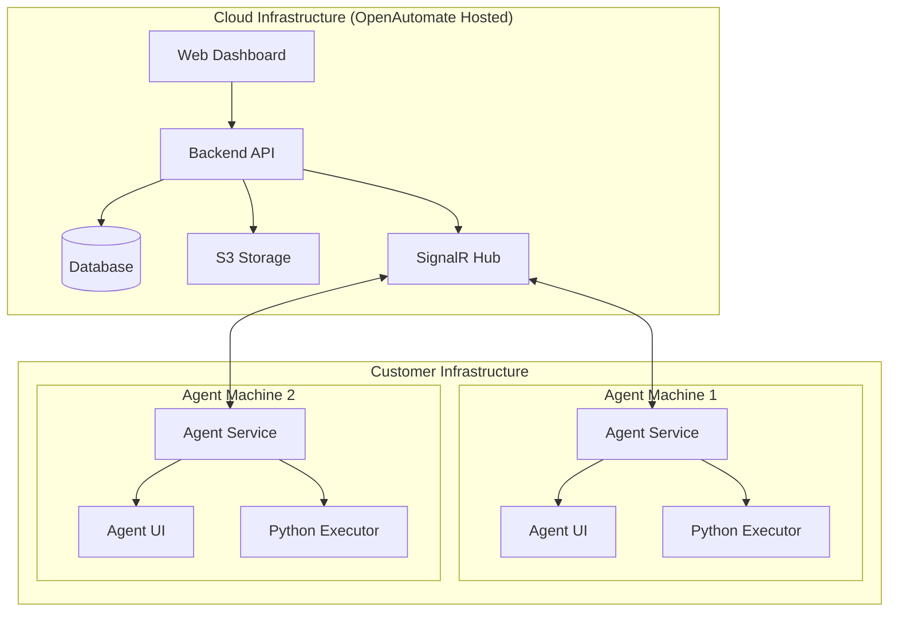
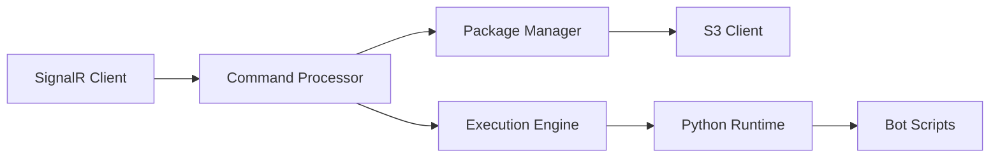
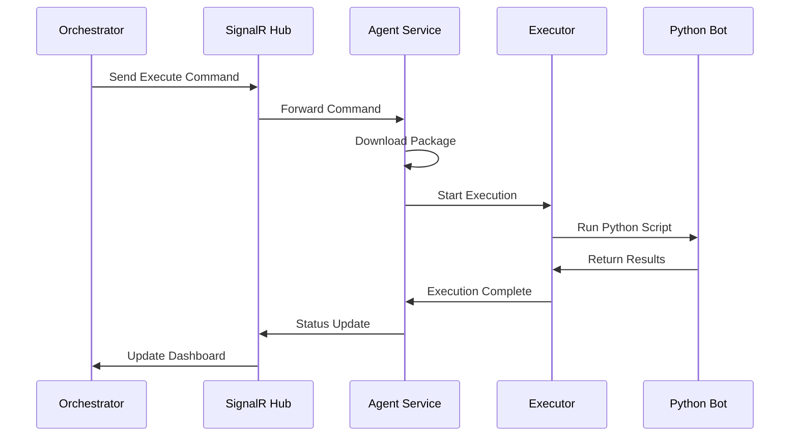

# System Architecture

OpenAutomate follows a distributed microservices architecture with clear separation between the orchestration layer and execution layer.

## High-Level Architecture

## Component Details

### Frontend Layer
- **Next.js Application**: Modern React-based web interface
- **Real-time Updates**: SignalR integration for live status updates
- **Multi-tenant UI**: Organization-specific dashboards and data
- **Responsive Design**: Works on desktop, tablet, and mobile devices

### Backend Services
- **ASP.NET Core API**: RESTful services with OpenAPI documentation
- **Entity Framework Core**: Database abstraction with multi-tenant filtering
- **SignalR Hub**: Real-time communication with agents
- **Background Workers**: Scheduled tasks and maintenance operations

### Data Layer
- **PostgreSQL Database**: Primary data storage with ACID compliance
- **S3-Compatible Storage**: Package and asset storage
- **Redis Cache**: Session management and performance optimization
- **Audit Logging**: Comprehensive activity tracking

### Agent Architecture

#### Windows Service

#### Communication Flow

## Security Architecture

### Authentication & Authorization
- **JWT Tokens**: Stateless authentication with refresh tokens
- **Role-Based Access Control**: Granular permissions per organization
- **Machine Key Authentication**: Unique keys for agent registration
- **API Key Management**: Secure programmatic access

### Data Protection
- **Encryption at Rest**: Database and storage encryption
- **Encryption in Transit**: TLS 1.3 for all communications
- **Credential Vault**: Secure asset storage with encryption
- **Audit Trail**: Complete activity logging for compliance

### Network Security
- **HTTPS Only**: All web traffic encrypted
- **WebSocket Security**: Secure real-time connections
- **IP Whitelisting**: Optional network access controls
- **Rate Limiting**: API protection against abuse

## Scalability Design

### Horizontal Scaling
- **Stateless Services**: API servers can be load balanced
- **Database Sharding**: Support for multiple database instances
- **CDN Integration**: Global content delivery for packages
- **Auto-scaling**: Cloud infrastructure scales with demand

### Agent Scalability
- **Unlimited Agents**: No licensing restrictions on agent count
- **Load Distribution**: Intelligent package distribution
- **Resource Management**: Configurable execution limits
- **Failover Support**: Automatic agent health monitoring

## Performance Optimizations

### Caching Strategy
- **Redis Caching**: Frequently accessed data
- **CDN Caching**: Static assets and packages
- **Database Indexing**: Optimized query performance
- **Connection Pooling**: Efficient database connections

### Monitoring & Observability
- **Application Metrics**: Performance and usage tracking
- **Health Checks**: Automated system monitoring
- **Log Aggregation**: Centralized logging with search
- **Alerting**: Proactive issue notification

## Technology Stack

### Backend
- **Runtime**: .NET 8.0
- **Framework**: ASP.NET Core
- **Database**: Entity Framework Core
- **Real-time**: SignalR
- **Authentication**: JWT Bearer tokens

### Frontend
- **Framework**: Next.js 14
- **Language**: TypeScript
- **Styling**: Tailwind CSS
- **State Management**: React Query
- **Real-time**: SignalR Client

### Agent
- **Service**: .NET 8.0 Windows Service
- **UI**: WPF Application
- **Runtime**: Python 3.11+
- **Communication**: SignalR Client
- **Storage**: Local file system

### Infrastructure
- **Database**: PostgreSQL 15+
- **Storage**: S3-compatible object storage
- **Cache**: Redis 7+
- **Hosting**: Docker containers
- **Orchestration**: Kubernetes (optional)
