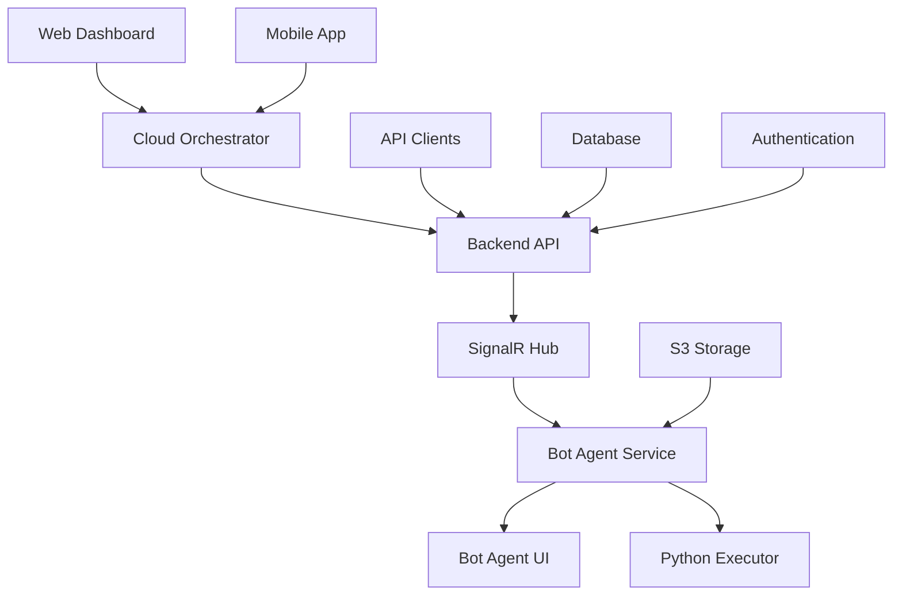

# Platform Overview

OpenAutomate is designed as a centralized orchestration platform with distributed execution architecture. This approach provides the perfect balance between centralized control and distributed scalability.

## Architecture

## Core Components

### Cloud Orchestrator
The web-based control panel hosted by OpenAutomate that provides:
- **Dashboard**: Real-time monitoring and analytics
- **Package Management**: Upload and distribute automation packages
- **Execution Management**: Monitor and control automation runs
- **User Management**: Role-based access control
- **Scheduling**: Configure automation schedules
- **Asset Management**: Secure credential storage

### Bot Agent
Distributed components deployed on your infrastructure:
- **Windows Service**: Background processing and communication
- **WPF UI**: Local configuration and monitoring interface
- **Python Executor**: Runs automation scripts in isolated environments
- **Local API**: Enables communication between components

### Python SDK
Comprehensive toolkit for building automations:
- **Asset Access**: Secure credential retrieval
- **Status Updates**: Real-time execution reporting
- **Logging**: Centralized log management
- **Error Handling**: Robust exception management

## Data Flow

1. **Package Creation**: Developers create automation packages using Python
2. **Package Upload**: Packages are uploaded to the Cloud Orchestrator
3. **Distribution**: Packages are securely distributed to registered agents
4. **Execution**: Agents execute automations based on schedules or triggers
5. **Monitoring**: Real-time status updates flow back to the orchestrator
6. **Reporting**: Execution results and logs are centralized for analysis

## Security Model

### Multi-Tenant Architecture
- **Organization Units**: Each tenant has isolated data and resources
- **Role-Based Access**: Granular permissions within organizations
- **Data Isolation**: Automatic tenant filtering at the database level

### Agent Security
- **Machine Keys**: Unique authentication for each agent
- **Encrypted Communication**: All data in transit is encrypted
- **Asset Protection**: Credentials are never stored locally on agents
- **Process Isolation**: Each automation runs in its own environment

## Deployment Models

### Cloud-Hosted Orchestrator
- OpenAutomate hosts the central management platform
- You maintain control over your execution infrastructure
- Automatic updates and maintenance for the orchestrator
- 99.9% uptime SLA for the management platform

### On-Premises Agents
- Deploy agents on your own infrastructure
- Full control over execution environment
- No data leaves your network during execution
- Scale agents based on your needs

## Benefits

- **Cost Effective**: No per-bot licensing fees
- **Scalable**: Add agents as needed without additional costs
- **Secure**: Your data stays on your infrastructure
- **Flexible**: Python-based automation with extensive libraries
- **Open Source**: Full transparency and community support
